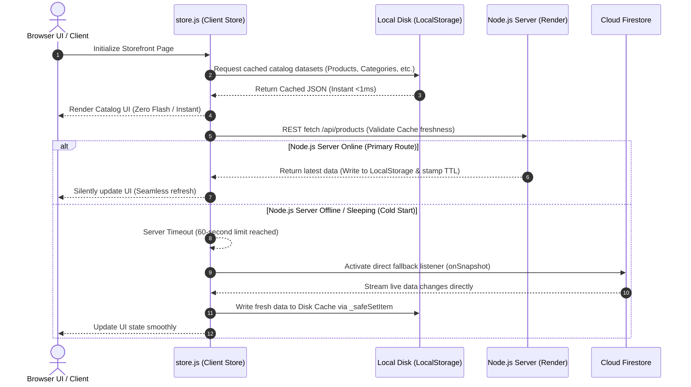
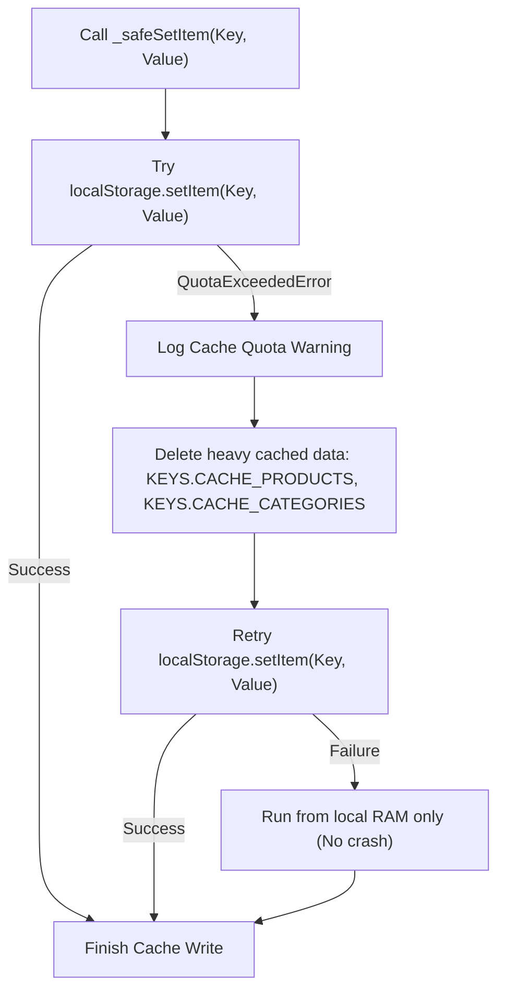
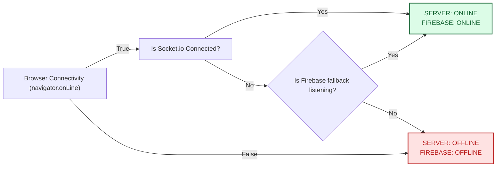
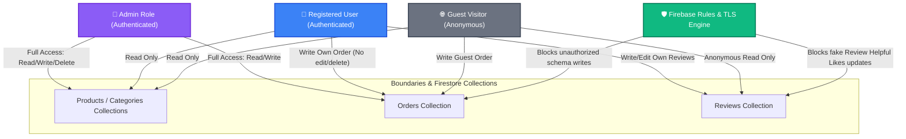

# 🚀 Kwabz Store PWA — System Architecture & Caching Blueprint
This document serves as the official, comprehensive technical blueprint of the **Kwabz Store Progressive Web App (PWA)** ecosystem. It details the interaction between the high-performance Node.js/Express cache server, Google Firebase Firestore, and the offline-first web client.

---

## 🗺️ 1. High-Level System Architecture
The following topology illustrates the complete end-to-end flow of data across the three core layers of the ecosystem: the **Storefront Client**, the **Node.js Optimization Layer**, and the **Firestore Database**.

```mermaid
graph TD
    %% Styling
    classDef client fill:#3b82f6,stroke:#1d4ed8,stroke-width:2px,color:#fff;
    classDef server fill:#10b981,stroke:#047857,stroke-width:2px,color:#fff;
    classDef db fill:#f59e0b,stroke:#b45309,stroke-width:2px,color:#fff;
    classDef sw fill:#8b5cf6,stroke:#6d28d9,stroke-width:2px,color:#fff;

    %% Client Tier
    subgraph Client Tier (PWA)
        A["Browser UI (Storefront / Admin)"]:::client
        B["Store Logic (store.js)"]:::client
        C["Service Worker (sw.js v22)"]:::sw
        D["Disk Cache (LocalStorage / IndexedDB)"]:::client
    end

    %% Network / Backend Optimization Tier
    subgraph Network & Backend Optimization Tier
        E["Node.js / Express Server (Render)"]:::server
        F["Socket.io Engine (WebSockets)"]:::server
        G["Redis Cache (Optional RAM Store)"]:::server
    end

    %% Database Tier
    subgraph Database Tier (Cloud Infrastructure)
        H["Cloud Firestore (Spark Tier)"]:::db
        I["Firebase Auth Engine"]:::db
    end

    %% Data Flow Connections
    A <-->|"Reads/Writes UI State"| B
    B <-->|"1. Sync Init (Stale-While-Revalidate)"| D
    B <-->|"2. Stale-While-Revalidate Assets"| C
    
    %% API / WS Flow
    B ===|"3. Real-Time WS (Socket.io) Primary Push"| F
    B ===|"4. REST Cache Proxy (Reviews/API)"| E
    
    %% Failover / Database Flow
    B -.->|"5. Direct Firestore Sync (Fallback Mode)"| H
    A -->|"6. Authentication"| I
    
    %% Backend DB / Redis Flow
    E <-->|"In-Memory Cache invalidation"| G
    E ===|"7. Single Live-Sync Connection"| H
    F <-->|"Visitor Count & Events"| E
```

---

## ⚡ 2. The Stale-While-Revalidate (SWR) Caching Model
The system achieves sub-1ms initial load speeds and absolute offline functionality using a layered Stale-While-Revalidate caching sequence.



### 💾 Safe Storage Quota Guard Flow (`_safeSetItem`)
To ensure that storage full limits (`QuotaExceededError`) never crash the customer's PWA or lose their active shopping cart:



---

## 🟢 3. Live 24/7 Status Integration
To prevent false-alarm "Offline" indicators and Render cold-start spikes, the connectivity state represents the total client-to-cloud path:



* **The Heartbeat Sweep:** The Node.js server maintains an active map of connected visitors in memory. A background timer runs every **30 seconds**, sweeping and evicting any visitors inactive for 15 minutes, and broadcasts updated dashboard counts.
* **Keep-Alives:** The client sends an automatic websocket ping to the server every **25 seconds**. The server implements an internal self-ping interval every **8 minutes** to keep its Render hosting container awake and prevent spin-downs.

---

## 🛡️ 4. Multi-Layer Security Architecture

The storefront is protected by strict permission boundaries, TLS encryption, and custom write rules.



### Key Security Specifications:
1. **Transport Layer Security (TLS):** All REST transactions, heartbeats, and WebSocket feeds are bound by full **TLS 1.3 / SSL** certificates, preventing man-in-the-middle exploits.
2. **Review Integrity Protection:** Direct review edits/updates in Firestore rules are locked to `request.auth.uid == resource.data.user_id`. Helpful/Like increments are capped strictly to single increment steps to prevent spam scripts.
3. **Database Write Gates:** Product creation, categories modifications, and order updates are strictly sandboxed. Direct database collection access is unauthorized without custom role certification checks in `firestore.rules`.

---

## 📊 5. Billing Optimization & Cost-Savings Formula
By utilizing the Node.js server to multiplex Firestore reads, we achieve massive cost savings. The difference in reads billed is formulated as follows:

$$\text{Daily Firestore Reads (Native Direct)} = N \times (P + C + S + O)$$

$$\text{Daily Firestore Reads (Node.js API)} = 1 \times (P + C + S + O)$$

Where:
* $N$ = Number of unique storefront loads per day.
* $P$ = Size of `products` collection.
* $C$ = Size of `categories` collection.
* $S$ = Size of `sellers` collection.
* $O$ = Size of `orders` collection.

### 📈 Concrete Scenario Comparison:
For a standard campus storefront processing **1,500 daily page visits** with **100 products**, **15 categories**, **10 sellers**, and **50 orders** (Total dataset size = **175 documents**):

* **Native Firestore Direct Configuration:**
  $$1,500 \times 175 = 262,500 \text{ Firestore reads/day}$$
  *(This immediately blows through the free Spark Tier daily allowance of 50,000 reads!)*

* **Kwabz Optimized Node.js Configuration:**
  $$1 \times 175 = 175 \text{ Firestore reads/day}$$
  *(Under 0.4% of the daily free tier limit, keeping database operations **100% FREE** even under massive campus viral scaling!)*
