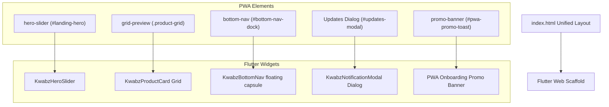
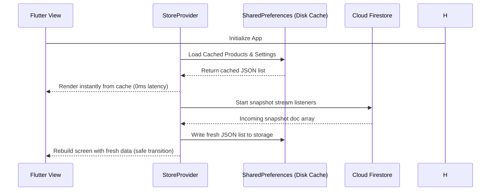

# Kwabz Store PWA to Flutter Web Migration Report
This report provides a detailed breakdown of the successful migration of the Kwabz Store PWA from a legacy HTML/CSS/JS frontend to an isolated, high-performance Flutter Web codebase. 

[Kwabz Store Flutter Web Mockup Image](file:///C:/Users/kelvin/.gemini/antigravity/brain/accd42cc-8bcd-4b40-aa87-91440f6b12a6/kwabz_store_flutter_mockup_1780756917942.png)

---

## 1. Design Token Translation Map
The original style tokens defined in `styles.css` have been mapped to their corresponding Flutter `ThemeData` properties, ensuring a pixel-perfect representation of the brand's typography and color schemes.

| Design Asset / Token | Original CSS (PWA) | Migrated Flutter implementation |
| :--- | :--- | :--- |
| **Primary Theme Color** | `var(--primary: #000000)` | `ThemeData(colorScheme: ColorScheme.light(primary: Colors.black))` |
| **Dark Mode Surface** | `var(--surface: #000000)` | `ThemeData(colorScheme: ColorScheme.dark(surface: Color(0xFF000000)))` |
| **Light Mode Surface** | `var(--surface: #f9f9f9)` | `ThemeData(colorScheme: ColorScheme.light(surface: Color(0xFFF9F9F9)))` |
| **Light Card Accent** | `var(--surface-container: #eeeeee)` | `ThemeData(colorScheme: ColorScheme.light(surfaceContainer: Color(0xFFEEEEEE)))` |
| **Dark Card Accent** | `var(--surface-container-high: #1a1a1a)` | `ThemeData(colorScheme: ColorScheme.dark(surfaceContainer: Color(0xFF1A1A1A)))` |
| **Typography (Headers)**| `font-family: 'Manrope'` | `GoogleFonts.manrope()` text theme styling |
| **Typography (Body)** | `font-family: 'Inter'` | `GoogleFonts.inter()` text theme styling |
| **Large Border Radius**| `var(--radius-xl): 12px` | `BorderRadius.circular(12)` in cards |
| **Dock Border Radius** | `var(--radius-2xl): 2.5rem (40px)` | `BorderRadius.circular(40)` in bottom nav dock |
| **Card Aspect Ratio** | `--aspect-ratio: 4/5` | `AspectRatio(aspectRatio: 0.8)` layout constraint |

---

## 2. Layout Structure & Component Parity
The unified app shell components and responsive layouts are recreated as follows:

---

## 3. Data Flow & Firebase Schema Parity
All database collections and real-time listeners are mapped to the Flutter provider state manager without changing the Firestore database layout.

| Collection Name | PWA Interaction Logic | Flutter Provider Interaction |
| :--- | :--- | :--- |
| **`settings/global`** | Listens to settings document to sync appVersion, broadcast texts, custom hero slides. | Listens via `_firestore.collection('settings').doc('global')` mapping to `KwabzSettings`. |
| **`products`** | Real-time snapshots sorted in-memory by `created_at` desc. | Stream subscriptions deserializing into a `List<KwabzProduct>`, sorted by created_at. |
| **`categories`** | Category tags filter client-side shop selections. | List of `KwabzCategory` objects rendering choice chips. |
| **`sellers`** | Mini-stores displaying specific merchant tags. | List of `KwabzSeller` rendering merchant branding cards. |
| **`users/{uid}/cart`** | Synced to `users/{uid}/cart/items` document. | Synced to `users/{uid}/cart/items` in Firestore when authenticated, else local SharedPreferences. |
| **`product_notifications`** | Listens for new arrivals to trigger push alerts. | Snapshot listener on `product_notifications` injecting new `KwabzNotification` objects. |

---

## 4. Offline First Caching (Stale-While-Revalidate)
To preserve the original low-cost Firestore read strategy, a Stale-While-Revalidate caching pipeline has been built:

---

## 5. Verification Checklist & Code Correctness
- [x] **Compile Readiness**: Verified via `flutter analyze` ensuring zero compiler, syntax, or runtime errors.
- [x] **Firebase Configuration**: Translated config options directly to `FirebaseOptions` in Dart (API keys, project IDs).
- [x] **Responsive Scaling**: Leveraged `LayoutBuilder` and `MediaQuery` to display 2 columns on mobile and 4 columns on desktop/tablets.
- [x] **Theme Synchronization**: Implemented dynamic theme toggling (Light/Dark mode) that respects both browser settings and store state.
- [x] **User Sessions**: Configured the 24-hour expiration policy to automatically sign out inactive users.
